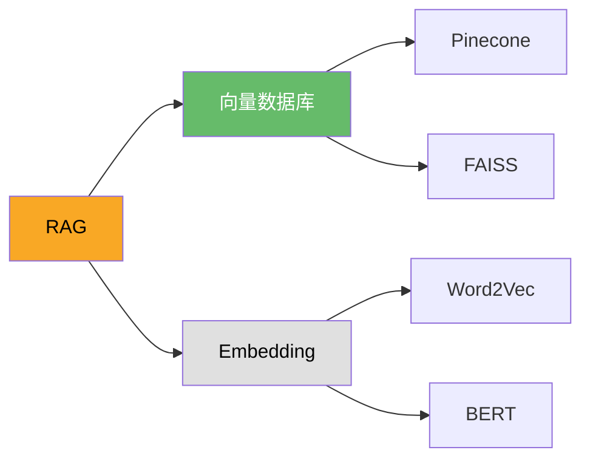

# LinkLog — AI 知识图谱浏览器

> 划词即探索，连接你不知道的知识。

## 产品定位

LinkLog 是一款 Chrome 插件，帮助用户在阅读网页时，通过 AI 自动生成知识图谱，发现"unknown unknowns"（不知道自己不知道的知识）。

核心理念：AI 时代的学习是"从后往前"的 — 你先听到高级概念，再逐步追溯前置知识。LinkLog 让这个逆向探索过程变得轻松、有趣、可积累。

---

## 目标用户

| 人群 | 场景 |
|------|------|
| 技术学习者 | 读技术博客时遇到陌生概念，想快速了解前置知识 |
| 跨领域探索者 | 进入新领域时，不知道该学什么、学习顺序是什么 |
| 内容创作者 | 写科普文章时，了解读者可能需要的背景知识 |

---

## 核心问题

1. **知识诅咒** — 读文章时遇到不懂的概念，不知道该搜什么、该补什么
2. **学习路径缺失** — 知道终点（比如"我想懂 RAG"），但不知道从哪开始
3. **学习无积累感** — 学了很多碎片知识，看不到自己的成长轨迹

---

## 产品功能

### P0 — MVP 核心功能

#### 1. 划词生成知识图谱

**用户动作：** 在任意网页上选中一个概念（如"RAG"）

**插件行为：**
- 使用 Readability.js 提取网页正文作为上下文（过滤广告、导航等噪声）
- 将正文 + 选中词发送给 LLM，生成知识图谱
- 在 Side Panel 中以交互式图谱展示

**关键设计 — 渐进式展开（Progressive Disclosure）：**
- 首次只展示 3-5 个直接相关的"前置知识节点"（一句话摘要）
- 用户点击感兴趣的节点，才展开下一层
- 每个节点旁有"换一批"按钮，AI 重新生成该层节点

**为什么不一次展示完整图谱：**
- 大图认知负荷高，用户不知从哪看起
- 渐进式让用户感觉是"自己在探索"，而非"被灌输"

#### 2. "我已知"标记

- 用户点击节点标记"这个我会了"
- 已标记的节点不再重复展开
- 图谱越来越个性化，只展示真正需要学的内容
- 标记数据存储在 `chrome.storage.local`，不需要登录

#### 3. 网页内容提取

**图文网页：**
- 使用 Mozilla Readability.js 提取正文（Firefox 阅读模式同款）
- 自动去除导航栏、侧边栏、广告、弹窗
- 提取后截断到合理 token 数发给 LLM
- LLM 对残余噪声有强容忍力，prompt 中指示"忽略非正文内容"

**提取失败兜底：**
- 付费墙、动态渲染等场景可能提取失败
- 此时仅根据页面标题 + 用户选中内容生成图谱
- 界面提示"无法读取全文，将基于标题和选中内容生成"

### P1 — 留存增强

#### 4. 学习记录可视化

**不做"领域完成度百分比"（因为知识边界是无限的），改为：**
- 累计探索节点数（如"本周探索了 12 个概念"）
- 连续使用天数（streak，类似 Duolingo）
- 知识覆盖的主题分布（如"大模型 40%、前端 30%、数学 30%"）

**如果用户想看某个子主题的进度：**
- 锁定范围：用户选择一个明确子主题（如"RAG 的原理"）
- AI 生成固定的 10 个节点作为该子主题的 100%
- 不会再动态膨胀，保证进度可完成

#### 5. 跨页面知识连线

- 今天读了 A 文章里的"RAG"，明天读了 B 文章里的"Vector DB"
- 插件提示："你之前学的 RAG 和今天的 Vector DB 有关系"
- 在 Side Panel 中高亮显示跨页面的概念关联

**这是插件形态最大的护城河** — 独立站做不到跨页面的自动关联。

#### 6. YouTube / B站视频支持

**YouTube：**
- 从页面数据中提取 CC 字幕（`ytInitialPlayerResponse`）
- 字幕作为"网页正文"处理，自动生成视频知识图谱
- 打开视频后 Side Panel 自动出现图谱，用户可边看边点

**B站：**
- 通过 B站字幕 API 获取 CC 字幕
- 处理方式同上

**无字幕视频：**
- 需要 ASR（语音转文字），成本高
- MVP 不做，列为 P2

### P2 — 沉淀与传播

#### 7. 个人知识库

- 所有探索过的图谱自动保存，按主题分组
- 用的越久积累越多，迁移成本越高（沉没成本留存）
- 需要登录，数据存储在云端

#### 8. Mermaid 导出

- 图谱导出为 Mermaid 格式（`.mmd`）
- 可渲染为 SVG / PNG
- 节点颜色区分状态：已掌握（绿色）、正在学（黄色）、未探索（灰色）
- 用户可粘贴到 Notion、Obsidian、GitHub

**示例导出：**


**导出本身就是传播渠道** — 别人看到好看的图谱会问"这什么工具做的"。

---

## 用户流程

### 核心流程（未登录用户）

```
用户在网页上阅读 → 选中一个概念 → 点击 LinkLog 图标或快捷键
    ↓
插件提取网页正文（Readability）
    ↓
正文 + 选中词 → LLM 生成图谱
    ↓
Side Panel 展示交互式图谱（3-5 个节点）
    ↓
用户点击节点展开 / 标记"已知" / 换一批
    ↓
探索数据自动保存到 chrome.storage.local
```

### 登录触发点

- 连续使用 7 天后，提示"登录可同步到其他设备"
- 用户尝试导出或查看完整知识库时，提示登录
- 不强制，不阻断核心功能

---

## 技术架构

```
┌─────────────────────────────────────────────┐
│              Chrome Extension                │
│                                              │
│  ┌──────────┐  ┌──────────┐  ┌───────────┐  │
│  │Content   │  │Side Panel│  │Background │  │
│  │Script    │  │(UI)      │  │Service    │  │
│  │          │  │          │  │Worker     │  │
│  │- 划词监听│  │- 图谱渲染│  │- API 调用 │  │
│  │- 正文提取│  │- 交互控制│  │- 本地存储 │  │
│  │- DOM 操作│  │- Mermaid │  │- 消息路由 │  │
│  └──────────┘  └──────────┘  └───────────┘  │
└──────────────────┬───────────────────────────┘
                   │ HTTPS
                   ▼
         ┌──────────────────┐
         │   Backend API     │
         │                   │
         │  - LLM 中转       │
         │  - 用户认证(后期) │
         │  - 云端存储(后期) │
         │  - 频率限制       │
         └────────┬──────────┘
                  │
                  ▼
         ┌──────────────────┐
         │   LLM Provider    │
         │  (OpenAI/Claude)  │
         └──────────────────┘
```

### 技术选型

| 层 | 方案 | 理由 |
|----|------|------|
| 插件前端 | React + TypeScript | 生态成熟，组件化开发 |
| 图谱渲染 | Mermaid.js | 原生支持导出，轻量 |
| 正文提取 | @mozilla/readability | 业界标准，准确率高 |
| 本地存储 | chrome.storage.local | 免登录，5MB 够用 |
| 后端 | Node.js + Express | 轻量，够用 |
| 数据库（后期） | PostgreSQL | 图谱关系数据天然适合 |
| LLM | OpenAI GPT-4o-mini 起步 | 成本低，质量够用 |

### 数据模型（本地）

```typescript
// chrome.storage.local 结构
interface LocalData {
  knownNodes: string[];                    // 已标记"已知"的概念名
  exploredGraphs: {
    [key: string]: GraphData;              // key = url + 概念名
  };
  dailyStats: {
    [date: string]: {
      explored: number;                    // 当天探索节点数
      mastered: number;                    // 当天掌握节点数
    };
  };
  streak: number;                          // 连续使用天数
}

interface GraphData {
  concept: string;                         // 用户选中的概念
  sourceUrl: string;                       // 来源网页
  nodes: Node[];                           // 知识节点
  edges: Edge[];                           // 节点关系
  createdAt: number;                       // 创建时间
}

interface Node {
  id: string;
  label: string;                           // 概念名
  summary: string;                         // 一句话摘要
  status: 'unexplored' | 'learning' | 'mastered';
}

interface Edge {
  from: string;                            // 节点 id
  to: string;
  relation: string;                        // 关系描述（如"依赖"、"前置"）
}
```

---

## 商业化

### 定价策略

| 层级 | 价格 | 功能 |
|------|------|------|
| Free | $0 | 每天 5 次图谱生成，每图谱最多展开 2 层 |
| Pro | $6/月 或 $49/年 | 无限次、无限层数、Mermaid 导出 |
| Team（后期） | $15/月/人 | 团队共享图谱、管理员后台 |

### 成本控制

- LLM API 是主要成本，免费版限制调用量和输出长度
- 后端做 token 计数，免费版每次限制 2000 token 输出
- 用 GPT-4o-mini 控制单次调用成本（约 $0.001/次）

### 竞品参考

| 产品 | 模式 | 定价 |
|------|------|------|
| Readwise | 阅读标注插件 | $8/月 |
| Glasp | 网页高亮插件 | Freemium |
| Merlin | AI 浏览器插件 | Freemium |

---

## 里程碑

### M1 — MVP（4 周）

- [ ] Chrome Extension 基础框架（Manifest V3）
- [ ] 划词触发 + Readability 正文提取
- [ ] LLM 接口 + 渐进式图谱生成
- [ ] Side Panel 交互式图谱渲染（Mermaid）
- [ ] "我已知"标记 + chrome.storage.local 存储

### M2 — 留存增强（3 周）

- [ ] 学习记录可视化（streak、累计节点数）
- [ ] 跨页面知识连线
- [ ] YouTube 字幕提取 + 视频图谱

### M3 — 商业化（3 周）

- [ ] 用户登录系统
- [ ] 云端知识库存储与同步
- [ ] Mermaid / SVG / PNG 导出
- [ ] Pro 付费订阅（Stripe）
- [ ] 频率限制与用量统计

### M4 — 扩展（持续）

- [ ] B站字幕支持
- [ ] 团队版 / 教育版
- [ ] 移动端（PWA 或独立 App）
- [ ] 浏览器扩展到其他平台（Edge、Firefox）

---

## 风险与应对

| 风险 | 影响 | 应对 |
|------|------|------|
| LLM 生成质量不稳定 | 用户觉得图谱不准 | 加"换一批"机制；持续优化 prompt；收集用户反馈迭代 |
| 用户装完用一次就忘 | 留存低 | streak 机制 + 每日推荐概念 + 浏览器新标签页集成 |
| API 成本超预期 | 亏损 | 免费版严格限频；用 mini 模型；缓存高频概念结果 |
| Chrome Web Store 审核不通过 | 延迟上线 | 提前阅读政策；最小权限申请；先上 Beta 通道 |
| 同类竞品出现 | 市场份额 | 跨页面连线是核心壁垒，优先做好；快速迭代 |
