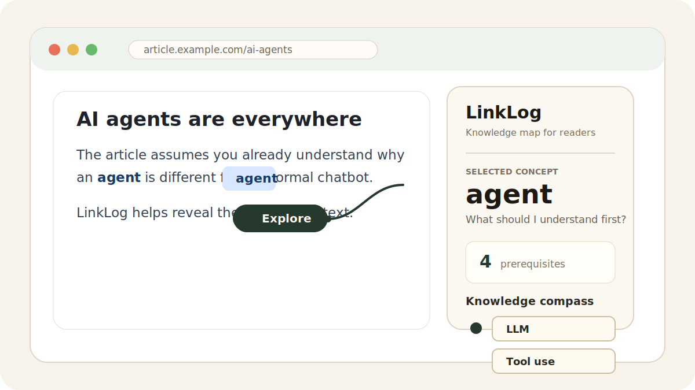
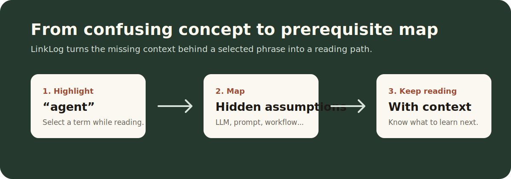

# LinkLog

**LinkLog is an AI knowledge-graph browser extension for readers who keep running into concepts that almost make sense.**

Highlight any concept on a webpage. LinkLog opens a Chrome side panel and maps the hidden prerequisite knowledge behind that concept, so you can keep reading with the missing context in front of you.



## Why LinkLog

Most AI reading tools summarize the page. LinkLog does something different: it explains what the page quietly assumes you already know.

When an article mentions `agent`, `RAG`, `prompt engineering`, `vector database`, or any other dense concept, the hard part is often not the sentence in front of you. The hard part is the prerequisite stack behind it. LinkLog turns that stack into a compact map.



## What It Does

- Select a phrase on any webpage and click **Explore**.
- Generate a prerequisite knowledge map in the Chrome side panel.
- Expand first-layer concepts when you need more context.
- Mark concepts as known and keep a lightweight learning history.
- Switch between English and Chinese UI.
- Export the current map as Mermaid for notes, GitHub Markdown, or documentation.
- Trial users do not need an API key. The trial build uses the hosted LinkLog backend proxy.

## Example

If you highlight **agent** while reading an AI article, LinkLog may surface concepts like:

- `LLM`
- `Prompt Engineering`
- `Agentic Workflow`
- `Tool Use`
- `Task Decomposition`

Instead of saying “agent means an autonomous AI system”, LinkLog helps answer the better reading question:

> What did this article expect me to understand before this sentence?

## Try The Trial Build

Download the latest trial build from the GitHub Releases page:

```text
https://github.com/CharlieDeng-CD/LinkLog_Google_Extension/releases
```

Install it manually in Chrome:

1. Download `chrome-mv3-prod.zip`.
2. Unzip it.
3. Open `chrome://extensions/`.
4. Turn on **Developer mode**.
5. Click **Load unpacked**.
6. Select the unzipped `chrome-mv3-prod` folder.
7. Open an article, refresh the page, highlight a concept, and click **Explore**.

## Current Trial Status

This is an early trial build. It is designed to validate whether prerequisite mapping is useful during real reading.

Current limits:

- Chrome only.
- Manual installation through `chrome://extensions`.
- First-layer expansion only, to keep maps readable.
- Hosted backend currently uses DeepSeek through a Cloudflare Worker.
- Generated content can occasionally be incomplete or too broad; feedback is welcome.

## Privacy And API Keys

Trial users do **not** need to enter an API key.

The extension sends the selected concept and page context to the hosted LinkLog backend proxy, which forwards the request to the model provider. The DeepSeek API key is stored as a Cloudflare Worker secret and is not included in the extension package or this repository.

## Development

Recommended runtime:

```bash
node --version
# v22.x
```

Install dependencies:

```bash
npm ci
```

Run checks:

```bash
npm run typecheck
npm run build
npm run smoke:content
npm run verify:bundle
```

Build the hosted trial extension:

```bash
PLASMO_PUBLIC_LINKLOG_API_BASE_URL=https://linklog-api.linklog.workers.dev npm run build
PLASMO_PUBLIC_LINKLOG_API_BASE_URL=https://linklog-api.linklog.workers.dev npm run package
```

The packaged Chrome extension is generated at:

```text
build/chrome-mv3-prod.zip
```

## Backend Proxy

The Cloudflare Worker proxy lives in:

```text
backend/cloudflare-worker
```

Deploy it with Wrangler:

```bash
cd backend/cloudflare-worker
npx wrangler secret put DEEPSEEK_API_KEY
npx wrangler deploy
```

The trial build currently points to:

```text
https://linklog-api.linklog.workers.dev
```

## Feedback

LinkLog is looking for early readers who regularly read AI, technical, research, or dense English/Chinese articles.

Useful feedback:

- Did the map help you continue reading?
- Were the prerequisites too obvious, too broad, or genuinely useful?
- Did the side panel feel fast and understandable?
- What concept did you highlight?
- Would you use this again tomorrow?

